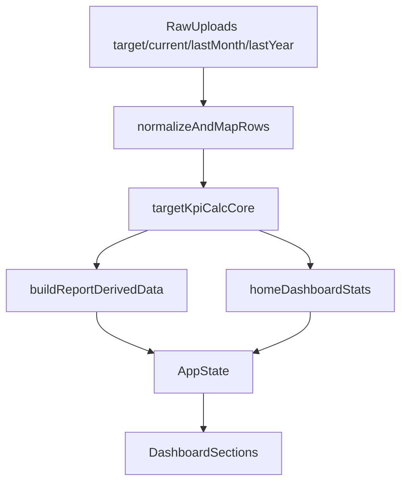

# แผนศึกษา KPI logic และแมปเข้าโปรเจคปัจจุบัน

## เป้าหมาย
- สกัดแกนคำนวณ KPI/target/forecast จากโปรเจคต้นทาง
- เทียบจุดต่างกับโค้ดปัจจุบันเพื่อระบุช่องว่างเชิง logic
- ออกแบบแนวทางย้าย logic แบบเป็นเฟส โดยยังไม่แก้โค้ดจริงในรอบนี้

## ไฟล์หลักที่ใช้เทียบ
- ต้นทาง: [`/Users/astronien/Downloads/studio7-sales-dashboard-main/utils/targetAggregations.ts`](/Users/astronien/Downloads/studio7-sales-dashboard-main/utils/targetAggregations.ts)
- ต้นทาง: [`/Users/astronien/Downloads/studio7-sales-dashboard-main/utils/aggregations.ts`](/Users/astronien/Downloads/studio7-sales-dashboard-main/utils/aggregations.ts)
- ต้นทาง: [`/Users/astronien/Downloads/studio7-sales-dashboard-main/views/TargetComparisonView.tsx`](/Users/astronien/Downloads/studio7-sales-dashboard-main/views/TargetComparisonView.tsx)
- โปรเจคเรา: [`/Users/astronien/Desktop/dashboard new version/src/lib/reportBuilder.ts`](/Users/astronien/Desktop/dashboard%20new%20version/src/lib/reportBuilder.ts)
- โปรเจคเรา: [`/Users/astronien/Desktop/dashboard new version/src/lib/salesAggregations.ts`](/Users/astronien/Desktop/dashboard%20new%20version/src/lib/salesAggregations.ts)
- โปรเจคเรา: [`/Users/astronien/Desktop/dashboard new version/src/lib/dashboardHelpers.ts`](/Users/astronien/Desktop/dashboard%20new%20version/src/lib/dashboardHelpers.ts)
- โปรเจคเรา: [`/Users/astronien/Desktop/dashboard new version/src/App.tsx`](/Users/astronien/Desktop/dashboard%20new%20version/src/App.tsx)

## สิ่งที่พบและแนวทางแมป
- โปรเจคต้นทางมี utility แยกชัดสำหรับ `target by period`, `target by KPI field`, `forecast`, `achievement%` ซึ่งโปรเจคเรามี logic คล้ายกันแต่กระจายใน `App.tsx` และ `reportBuilder.ts`
- โปรเจคต้นทางรองรับ KPI รายฟิลด์ (iPhone/iPad/Mac/Watch/SIM/BTB/BTBApple) พร้อม measure type (quantity/revenue) ส่วนโปรเจคเรายังเน้นคำนวณ category target แบบกว้าง
- จุดที่ควรย้ายก่อนคือ calculation contract ให้เป็นฟังก์ชันกลางเดียว เพื่อให้ `HomeDashboardSection` และส่วนรายงานใช้สูตรเดียวกัน

## แผนเฟสสำหรับการย้าย logic (รอบถัดไป)
1. สร้าง calculation layer กลางใน `src/lib` สำหรับ `getTargetForPeriod`, `getTargetForPeriodByField`, `calcForecast`, `calcAchievementPct`
2. ย้ายสูตรที่ซ้ำใน `App.tsx`/`reportBuilder.ts` มาเรียกฟังก์ชันกลาง เพื่อลด divergence ของผลลัพธ์
3. เพิ่ม adapter map หมวด KPI (เช่น SIM/BTB/BTBApple) ให้เข้ากับรูปแบบข้อมูล `RawRow` ของโปรเจคเรา
4. ค่อยเชื่อมผลไปยัง UI (`HomeDashboardSection` และ report sections) โดยไม่เปลี่ยนโครง UI เดิม
5. เพิ่ม test cases สำหรับสูตรหลัก (target sum ข้ามเดือน, forecast edge cases, ach% target=0)

## Data flow ที่แนะนำ

## ผลลัพธ์ที่ควรได้หลังจบเฟสย้าย
- สูตร KPI สำคัญอยู่จุดเดียว ลดโค้ดซ้ำ
- ตัวเลข KPI/forecast ระหว่าง report กับ home dashboard ตรงกัน
- รองรับการขยาย KPI field เพิ่มในอนาคตโดยไม่แก้ logic หลายไฟล์